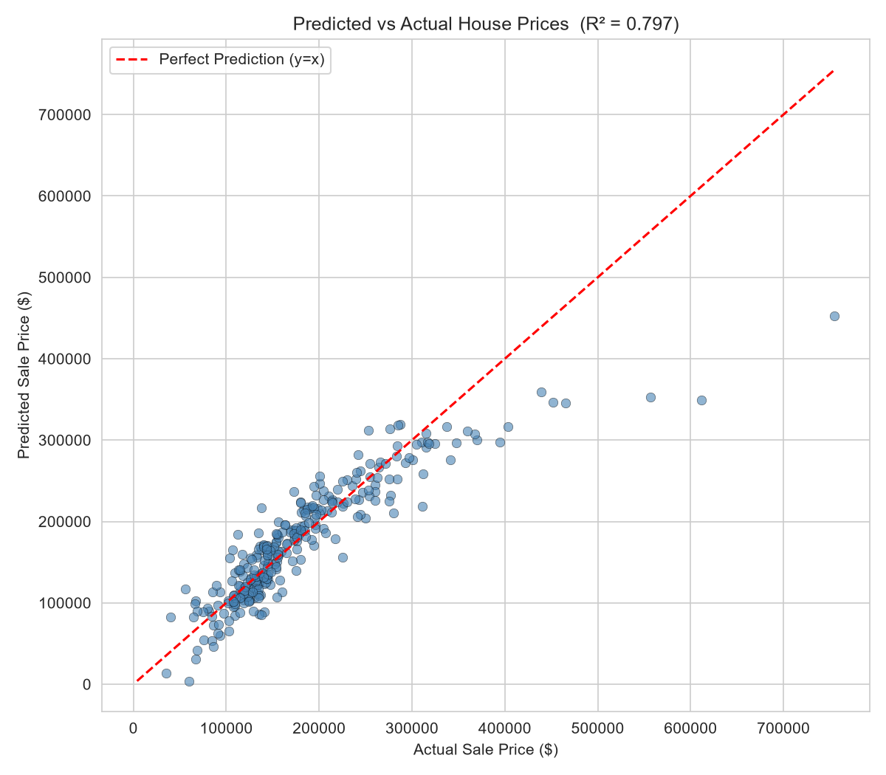

# House Price Prediction Model

**Mini Project 2** | Dataset: [House Prices – Advanced Regression Techniques (Kaggle)](https://www.kaggle.com/c/house-prices-advanced-regression-techniques)

A Linear Regression model that predicts residential house sale prices in Ames, Iowa,
based on key property features like quality, living area, and garage size.

## What this project does

- ✅ Trains a Linear Regression model
- ✅ Predicts house sale prices
- ✅ Evaluates performance using R² score, RMSE, and MAE
- ✅ Plots predicted vs actual values

## Project structure

```
├── house_prices_kaggle.csv                      # Raw dataset (Ames Housing, 1460 rows, 80 features)
├── mini_project2_house_price_model.py           # Full pipeline as a plain Python script
├── Mini_Project2_House_Price_Prediction.ipynb   # Same pipeline as a Jupyter notebook with explanations
├── predicted_vs_actual.png                       # Generated after running: predicted vs actual price chart
├── house_price_predictions.csv                   # Generated after running: actual vs predicted prices
├── requirements.txt
└── README.md
```

## Features used

Instead of all 79 raw columns, 9 strong, interpretable numeric features were selected:

| Feature | Description |
|---|---|
| `OverallQual` | Overall material & finish quality (1–10) |
| `GrLivArea` | Above-ground living area (sq ft) |
| `GarageCars` | Garage capacity (number of cars) |
| `GarageArea` | Garage size (sq ft) |
| `TotalBsmtSF` | Total basement area (sq ft) |
| `1stFlrSF` | First floor square footage |
| `FullBath` | Number of full bathrooms |
| `YearBuilt` | Original construction year |
| `YearRemodAdd` | Remodel year |

Missing values in these columns were filled with the **median** before training.

## Model & results

| Metric | Value |
|---|---|
| R² Score | ~0.80 |
| RMSE | ~$39,000 |
| MAE | ~$24,700 |

The model explains about **80% of the variation** in house sale prices. `OverallQual`
and `GrLivArea` are the strongest predictors — larger, higher-quality homes command
higher prices, matching real-world intuition.

## Visualization



Points close to the red dashed diagonal (y = x) indicate accurate predictions.
Larger deviations appear mostly at the high end, where expensive homes vary more.

## How to run

```bash
pip install -r requirements.txt
python mini_project2_house_price_model.py
```

Or open `Mini_Project2_House_Price_Prediction.ipynb` in Jupyter / VS Code to run it
cell-by-cell with explanations.

## Output

- `predicted_vs_actual.png` — scatter plot of predicted vs actual sale prices
- `house_price_predictions.csv` — side-by-side actual vs predicted prices for every test house

## Author

House price prediction mini-project — Supervised Learning (Regression) module.
